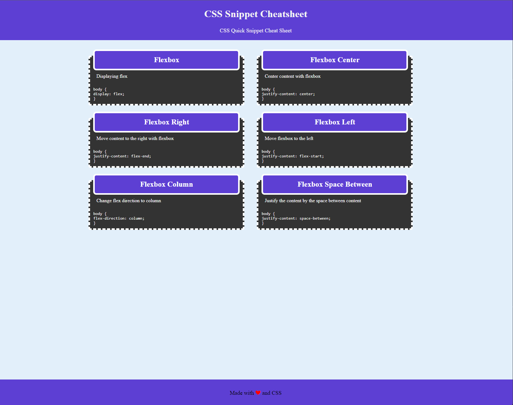

# css-snippets

CSS Snippets, small quick snippets sheet of CSS

# Description

A CSS snippets page, with a few different quick flexbox CSS snippets to help web devs quickly reference for use. As a bonus it is also mobile and responsive friendly

# Screenshot(s)

# Link to deployed page

[Link to page](https://jordanb366.github.io/css-snippets/)
